# ⚙️ 맡은 기능

수강신청 시스템의 핵심 로직인 **학생 옵션 기능 전반**과 **메시지 시스템**, **개인정보 관리 로직**을 전담하여 구현했습니다.

---

### 👥 팀 구성 및 협업 환경
* **팀 구성**: 백엔드 5명 (순수 자바 및 JDBC 기반 콘솔 환경 협업)
* **담당 역할**: 수강신청 제한 로직(우선순위 제어) 개발, 학생 옵션 및 내 기능 전용 메시지 시스템 구축
* **협업 도구**: GitHub, 카카오톡, Notion

---

#### 학생 메인 화면
> > 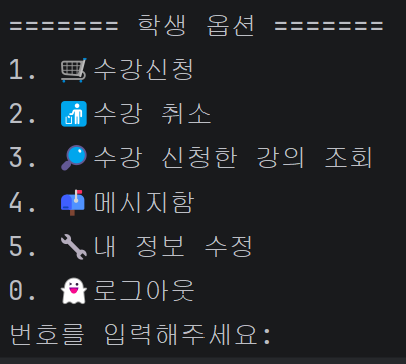

---

## 1. 수강신청 및 성적 관리 시스템

### 🎓 수강신청 로직 (핵심 제약사항 구현)
* **신청 제약 알고리즘**
     * **학점 기반 제한:** 현재 로그인한 사용자의 총 평점을 계산하여 신청 가능 학점을 차등 부여 (4.0 이상: 25학점 / 2.0 미만: 10학점 제한).
     * **인원 기반 제한:** 강의 테이블의 수강 제한 인원과 현재 신청 인원을 실시간 비교하여 초과 시 신청 차단.
     * **시간표 중복 검증:** 강의 시간표 문자열을 파싱하여 단순 일치뿐만 아니라 교차 시간대(`월1-2`와 `월2-3`)까지 비교 연산자로 검증하여 중복 신청 방지.
* **조회 및 출력:** 강의명, 강의실, 시간표, 강의 종류, 학점, 교수명, 수강 현황 등 다중 테이블 조인(`JOIN`) 출력으로 사용자 편의성 고려.

* 학점에 따른 수강 제한 화면 
> > 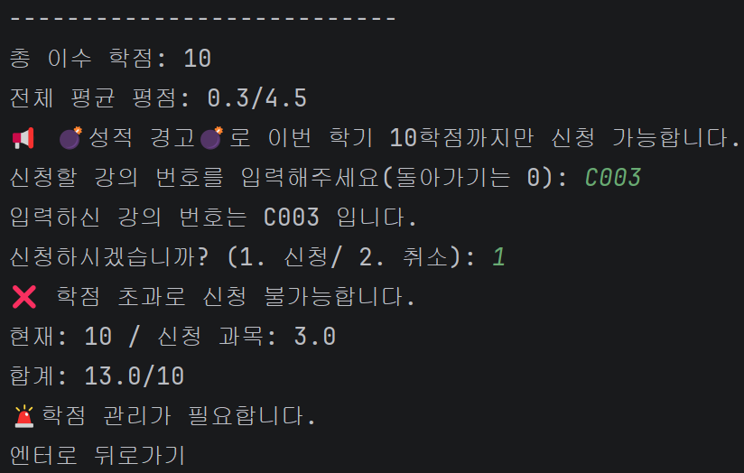

* 수강 인원 제한 화면 
> > 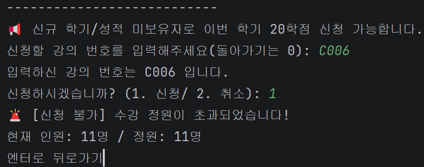

* 시간표 중복 제한 화면 
> > 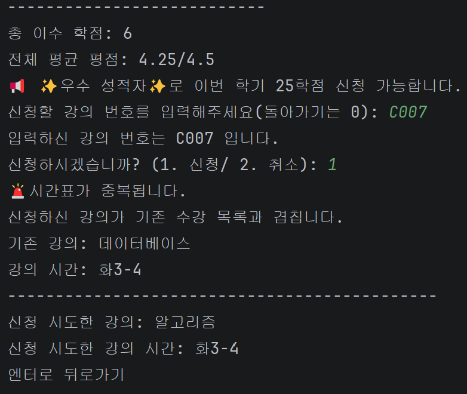

### 📊 성적 및 이수 내역 조회
* **전체/상세 성적:** 과목별 학점과 성적을 매핑하여 출력하고, 전체 이수학점 및 평균 평점을 계산하는 산출 로직 구현.
* **수강 취소:** 수강 내역에서 선택한 강의 번호를 바탕으로 수강 데이터 삭제 및 인원 수 업데이트 연동.

* 전체 성적 조회 화면 
> > 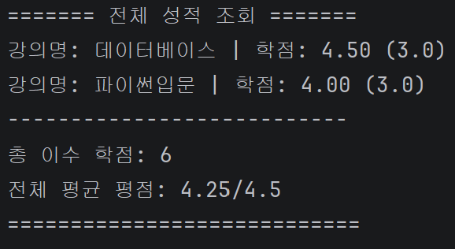

* 상세 성적 조회 화면 
> > 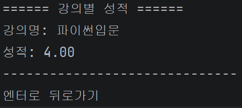

* 수강 내역 조회 화면 
> > 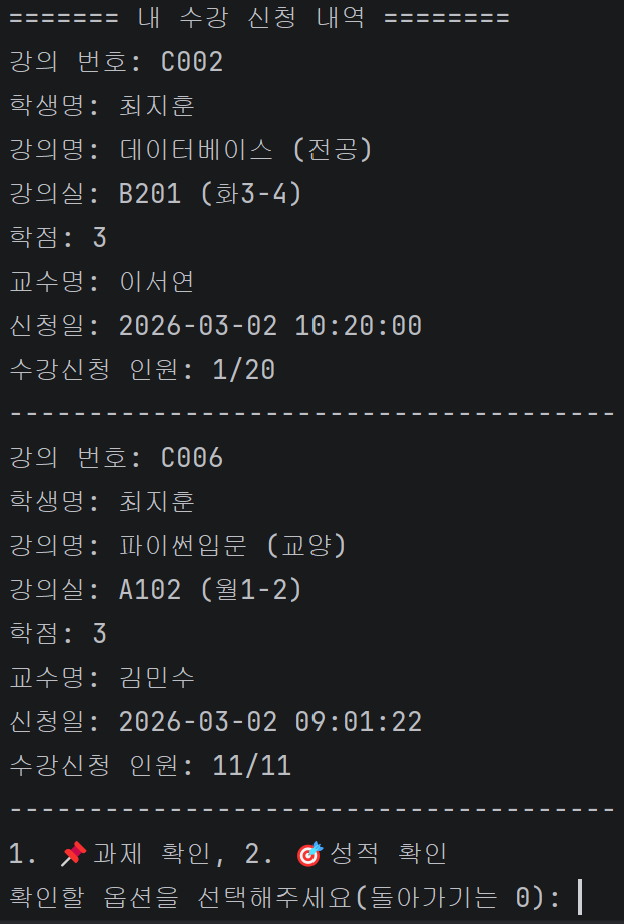

* 수강 취소 화면 
> > 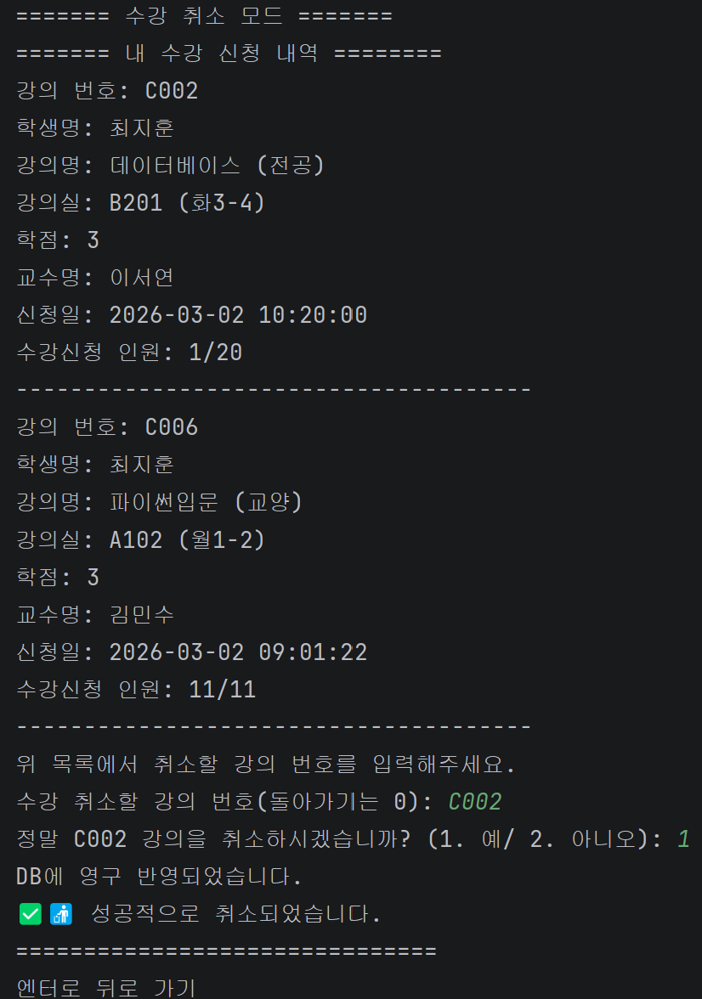
---

## 2. 메시지 시스템 (소통 채널)

### 📩 메시지함 관리(9개 팀 중 유일)
* **상태 관리:** 수신된 메시지 중 마지막 답장이 로그인한 사용자가 아닐 경우를 **'미확인'**으로 간주하여 답장이 필요한 건수를 별도로 카운트하여 출력.
* **채팅 UI 구현:** * 대화 상대방별 그룹화 및 마지막 대화 내용 출력.
     * 채팅창 상단에 년/월/일 및 요일을 1회 출력하여 시독성 확보.
     * 발신일 및 발신 시각 기록.
* **유연한 발신:** 학생/교수 테이블을 `UNION`으로 통합하여 전체 사용자 목록 구현 및 자기 자신에게 메시지 보내기 가능.

* 나에게 보내기 화면 
> > 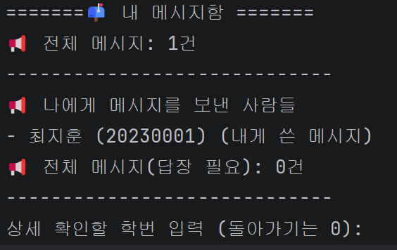

* 메시지 알림 화면 
> > 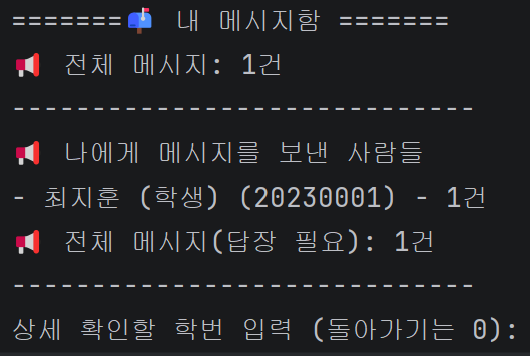

* 답장 및 채팅 내역 화면 
> > 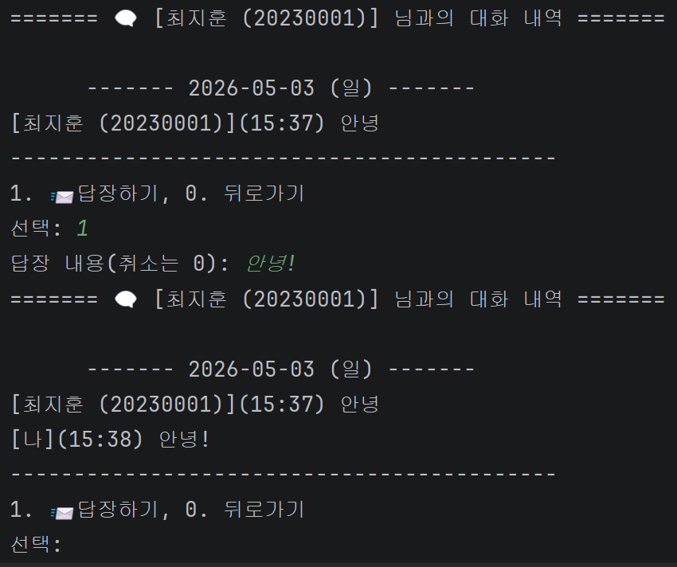

* 답장 후 읽음 처리 화면 
> > 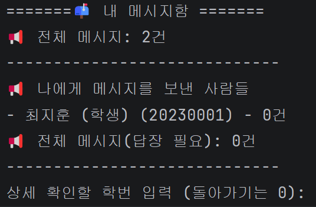

---

## 3. 정보 관리 및 유효성 검사

### 🔒 내 정보 수정 및 보안
* **데이터 마스킹:** 개인정보 보호를 위해 주민등록번호 뒷자리를 하이픈 뒤 첫 자리를 제외하고 `*`로 마스킹 처리 (예: 000101-3******).
* **입력 유효성 검사 (Validator):**
     * **이메일:** `@` 포함 여부 및 `.com` 종료 여부 검증.
     * **전화번호:** 11자리 숫자 입력 시 내부적으로 문자열을 가공하여 하이픈(`-`) 자동 삽입 처리.
     * **비밀번호:** 8자 미만 또는 특수기호 미포함 시 재입력 가이드 출력.
* **수정 로직:** 이름, 주소, 이메일, 연락처, 비밀번호 등 항목별 수정 기능 구현.

* 내 정보 수정 화면 
> > 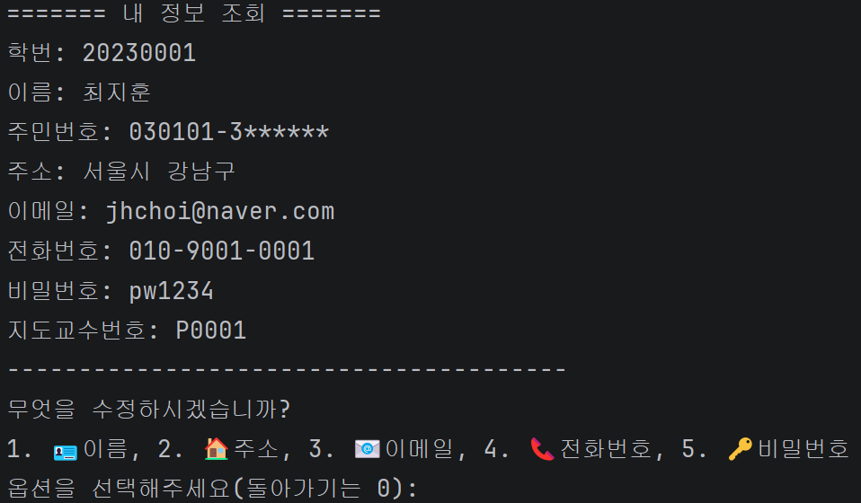

---

### 🔗 소스 코드 확인
* [모듈1 LMS 프로젝트 전체 소스 코드 보러가기 (GitHub)](https://github.com/2023158013-tech/wanted_project/tree/main/module01)
* 학생 관련 핵심 도메인: 각 레이어 패키지 내 Student* 관련 파일 일체 전담 개발
(StudentController, StudentService, StudentDAO, StudentDTO, StudentView)

---

## 💡 구현 특징 요약

1.  **데이터 무결성:** 단순 입력이 아닌 시간표 중복, 학점 제한 등 복합적인 제약 사항을 DB와 Java 로직에서 이중 검증함.
2.  **사용자 편의성:** 전화번호 자동 포맷팅, 메시지 읽음 상태 계산, 상세한 예외 메시지 출력 등을 통해 UX 개선에 집중함.
3.  **쿼리 최적화:** `UNION` 및 `JOIN`을 활용하여 여러 테이블에 흩어진 데이터를 목적에 맞게 통합 조회함.
