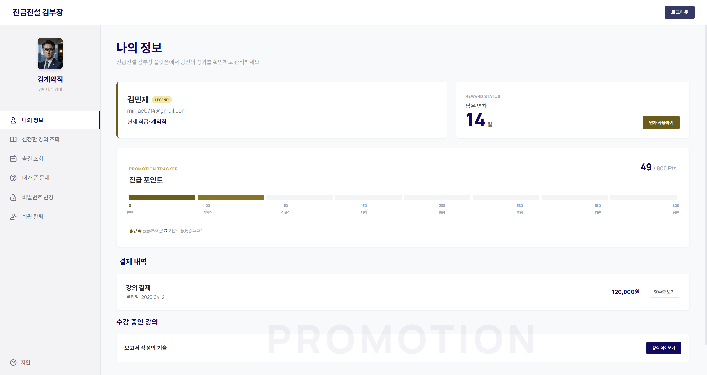
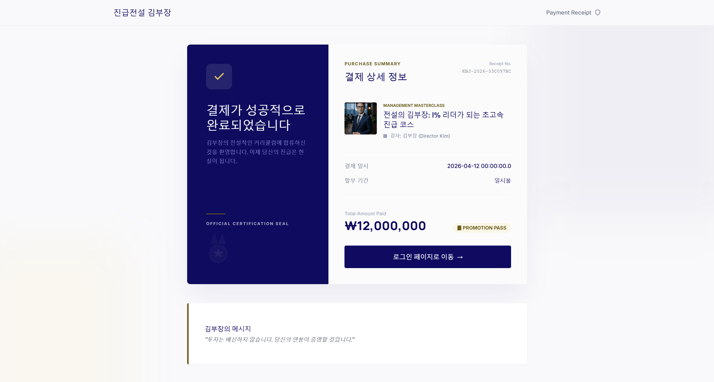
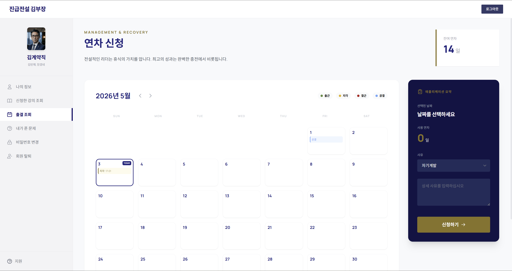
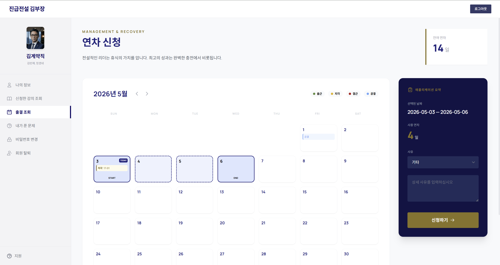
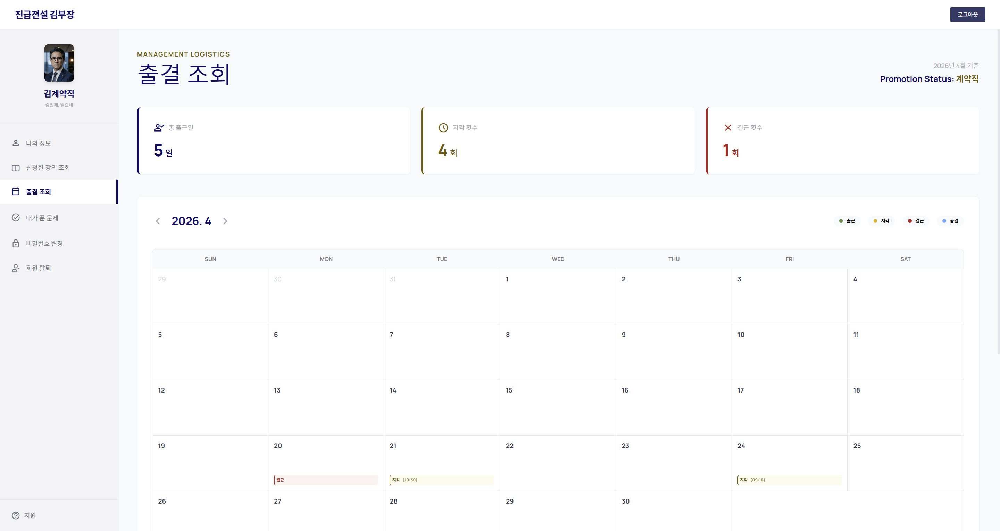
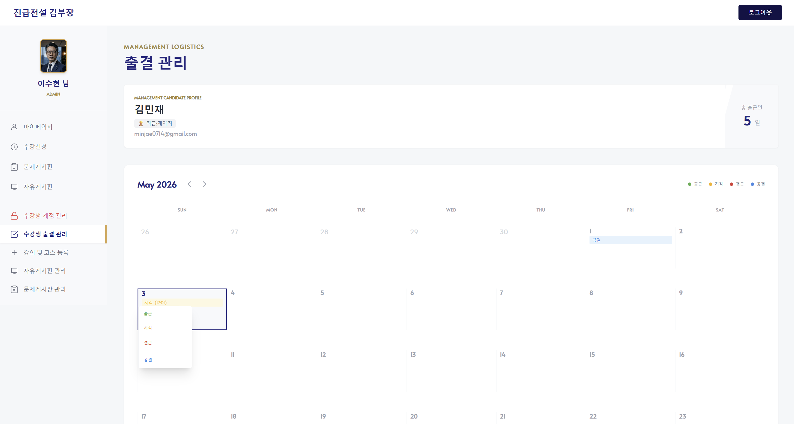
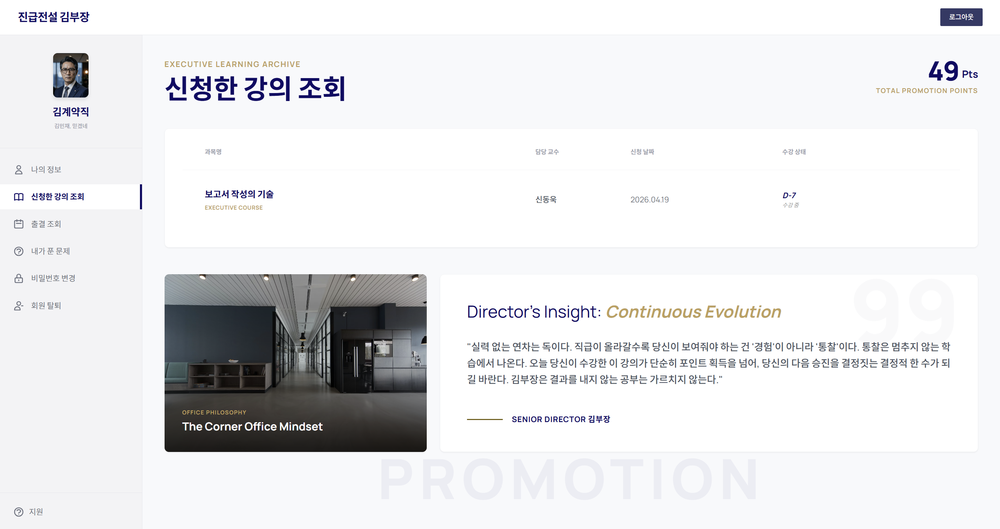
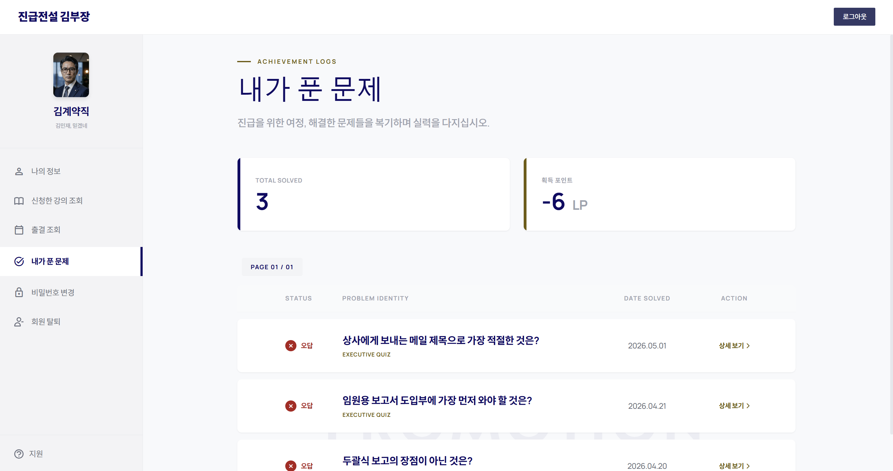
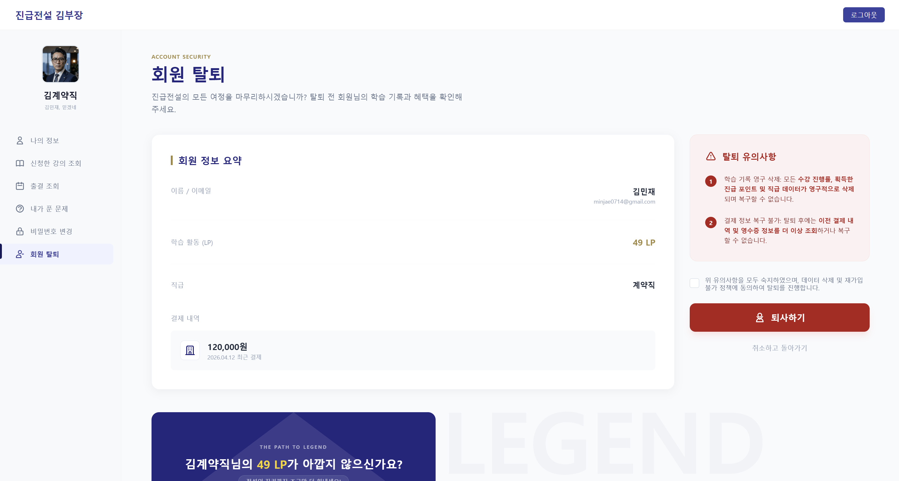

# ⚙️ 맡은 기능 (Module 2)

사용자 경험을 극대화하는 **마이페이지 전반**과 인사 관리의 핵심인 **근태/연차 시스템**, 그리고 **데이터 무결성을 고려한 회원 관리 로직**을 전담하여 구현했습니다.

---

### 👥 팀 구성 및 협업 환경
* **팀 구성**: 백엔드 4명 (AI 활용 화면 구현)
* **담당 역할**: 마이페이지 및 출결/연차 시스템
* **협업 도구**: GitHub, Slack, Notion

---

#### 마이페이지 레이아웃 및 UX 설계
> * **고정 사이드바**: 왼쪽 상단 프로필 고정 및 '성+직급' 조합 배치로 소속감 부여.
> * **심리적 독려**: 사용자 이름 하단에 "믿겠네" 등 학구열을 자극하는 위트 있는 문구를 배치하여 학습 동기 유발.
> * **직관적 동선**: 좌측 상단(메인 이동), 우측 상단(로그아웃), 좌측 하단(지원 메일) 등 표준화된 내비게이션 배치로 편의성 증대.

---

## 1. 개인화 정보 및 포인트 시스템

### 👤 나의 정보 관리
* **종합 정보 대시보드**: 이름, 메일, 직급, 잔여 연차, 포인트, 결제 내역, 수강 현황 등 개인 데이터를 한눈에 확인 가능하도록 설계.
* **동적 포인트 바**: 문제 풀이 및 강의 수강 결과에 따라 실시간으로 변동되는 프로그레스 바(Progress Bar) 구현.
* **게이미피케이션 요소**: 포인트별 직급 정보를 제공하고, 다음 직급 승급까지 남은 잔여 포인트를 산출하여 학습 동기 부여.
* **UUID 기반 영수증**: 결제 내역 조회 시 UUID를 활용한 랜덤 영수증 번호 생성 로직을 인용하여 결제일과 금액을 투명하게 출력.

* 마이페이지 기본-나의 정보 화면 
> > 

* 영수증 보기 화면 
> > 

---

## 2. 스마트 근태 및 출결 관리 시스템(9개 팀 중 유일)

### 📅 연차 신청 및 자동 차감 로직
* **Full Calendar 연동**: JS 기반의 동적 달력을 구현하여 직관적인 날짜 선택 UI 제공.
* **신청 제약 및 검증**:
    * **기간 제한**: 오늘 이전 날짜는 신청이 불가능하도록 차단.
    * **보유분 검증**: 선택한 날짜 범위를 계산하여 잔여 연차 개수 초과 시 신청 방지.
* **지능형 자동 출결**: 별도의 버튼 없이 페이지 진입 시 로그인 기록을 대조하여 출결 데이터가 없을 경우 자동 출석 처리 (지각 회피 방지를 위한 로직 고도화 필요).

* 연차 사용하기 화면 
> > 

* 연차 사용하기-날짜 선택 화면 
> >  

### 📊 출결 현황 및 관리자 제어
* **개인 출결 조회**: 총 출근일, 지각, 결근, 공결 횟수를 산출하여 출력하고, 달력 내에 형광펜 형식의 시각적 피드백 제공.
* **관리자 전용 수정 시스템**:
    * **타겟 조회**: `{userId}` 경로 변수를 활용해 특정 사용자의 출결 정보를 캘린더에 로드.
    * **드롭다운 수정**: 캘린더 내 날짜 선택 시 드롭다운 메뉴를 통해 출결 상태를 업데이트.
    * **데이터 보호**: **기존 정보를 업데이트(Update)**하는 방식이며, 출결 테이블에 기록이 없는 날짜는 수정을 차단하여 데이터 정합성 유지.

* 출결 조회 화면 
> 

* 관리자용 출결 수정 화면 
> 

---

## 3. 학습 현황 및 회원 유지 관리

### 📚 수강 및 학습 이력 조회
* **D-Day 일정 관리**: 신청 날짜와 수강 마감일을 계산하여 D-day 형식으로 일정 관리 도모.
* **문제 풀이 기록**: 총 푼 문제 수와 획득 포인트를 출력하며, 5개 단위의 페이징(Paging) 처리를 통해 학습 이력을 체계적으로 관리.

* 신청한 강의 조회 화면 
> > 

* 내가 푼 문제 조회 화면 
> > 

### 🔒 안전한 회원 탈퇴 로직
* **탈퇴 유의사항 검증**: 정보 노출 및 체크박스 동의 절차를 통해 우발적인 탈퇴 방지.
* **연쇄 삭제(Cascade) 처리 (p.69)**: JPA 및 DB 제약 조건을 고려하여 자식 테이블(댓글, 제출 문제, 게시글, 수강 내역, 섹션 등)의 데이터를 순차적으로 삭제하여 참조 무결성 오류 해결.
* **세션 종료 및 리다이렉트**: 탈퇴 완료 후 영속성 컨텍스트 및 세션 정보를 파기하고 자동으로 로그아웃하여 메인 페이지로 안전하게 이동.

* 회원 탈퇴 화면 
> 

---

### 🔗 소스 코드 확인
* [모듈2 LMS 프로젝트 전체 소스 코드 보러가기 (GitHub)](https://github.com/2023158013-tech/wanted_project/tree/main/module02)
* 마이페이지 관련 핵심 도메인: /mypage 패키지

---

## 💡 구현 특징 요약

1. **사용자 중심 UI/UX**: 실제 동작하는 캘린더 라이브러리와 드롭다운 인터페이스를 통해 복잡한 근태 관리 과정을 단순화함.
2. **데이터 정합성 확보**: 엔티티 설계 시 **Setter 사용을 지양**하고 **Builder 패턴**을 적용했으며, 회원 탈퇴 시의 연쇄 삭제 로직을 통해 DB 무결성을 유지함.
3. **학습 동기 부여**: 포인트 시스템과 직급 체계, D-day 관리 기능을 마이페이지에 통합하여 사용자의 지속적인 참여를 유도함.
