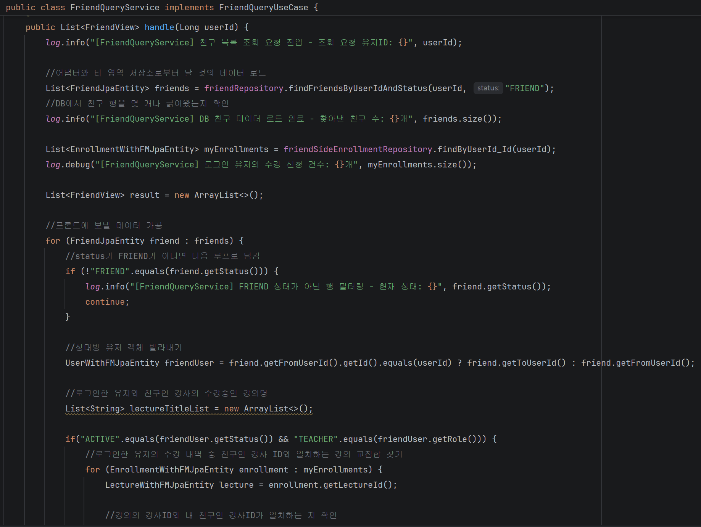
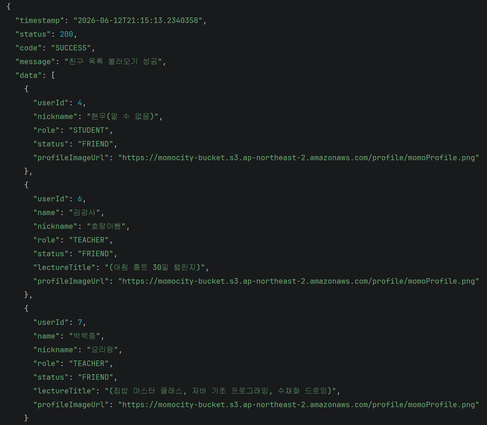
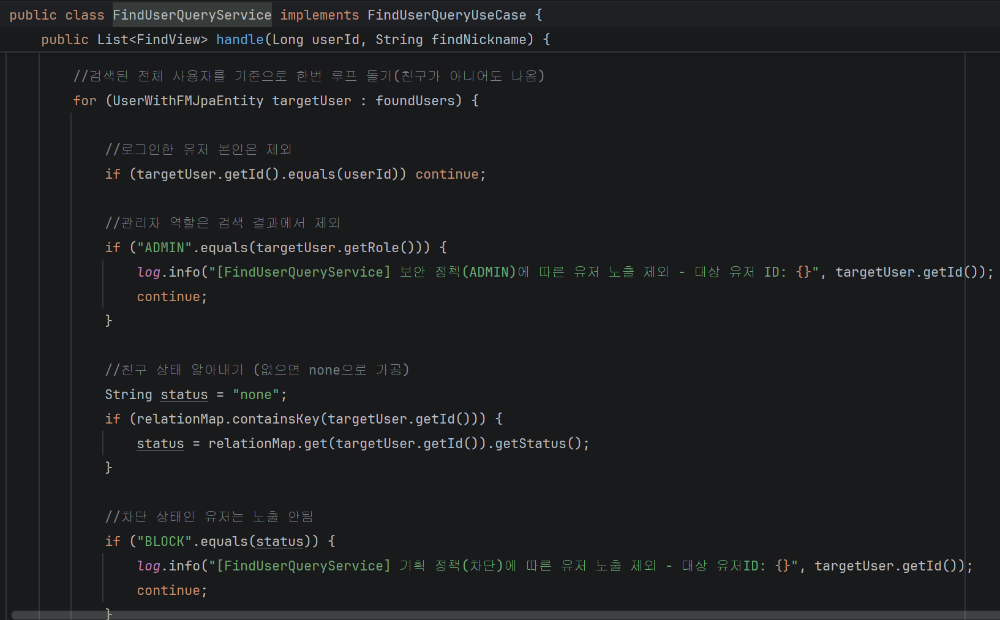
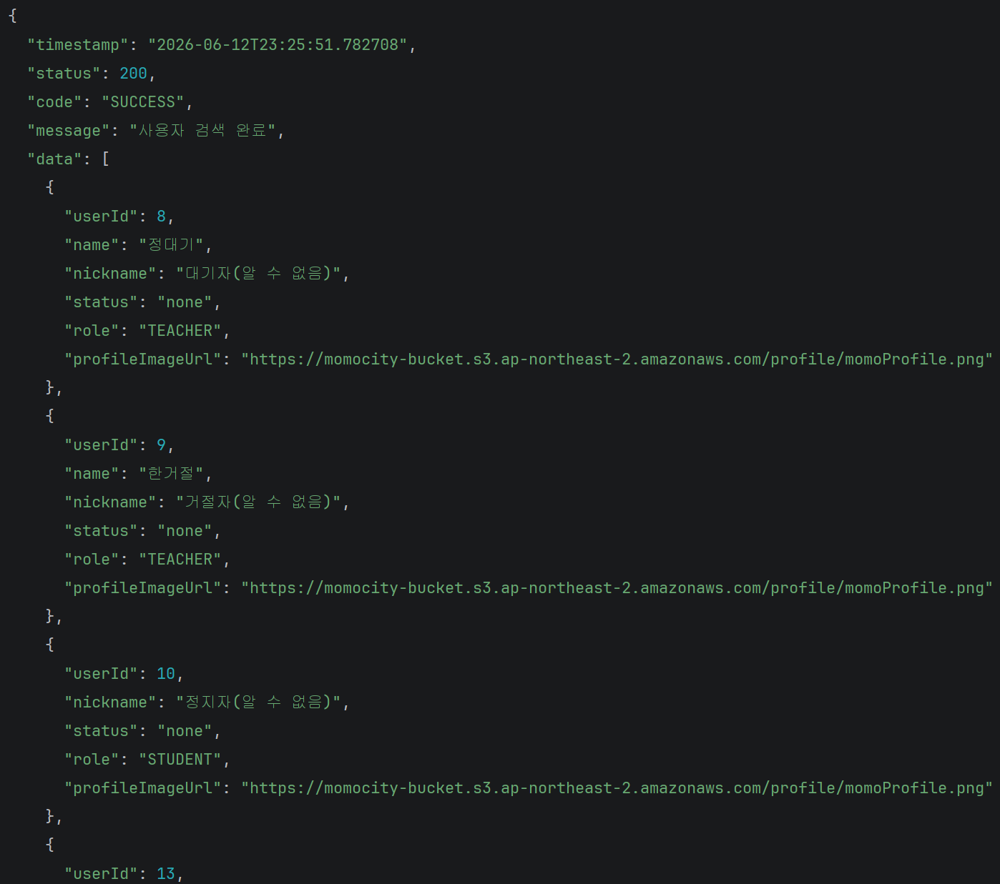
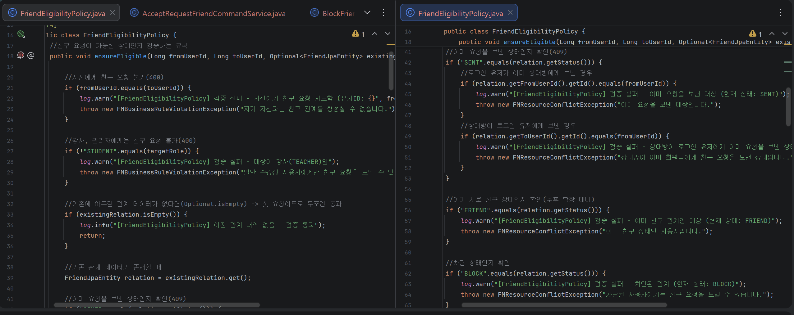
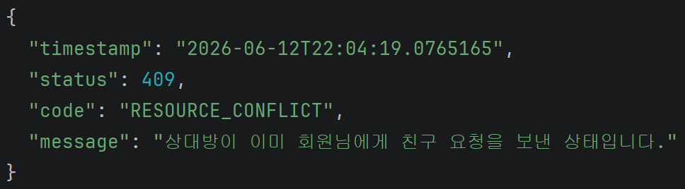
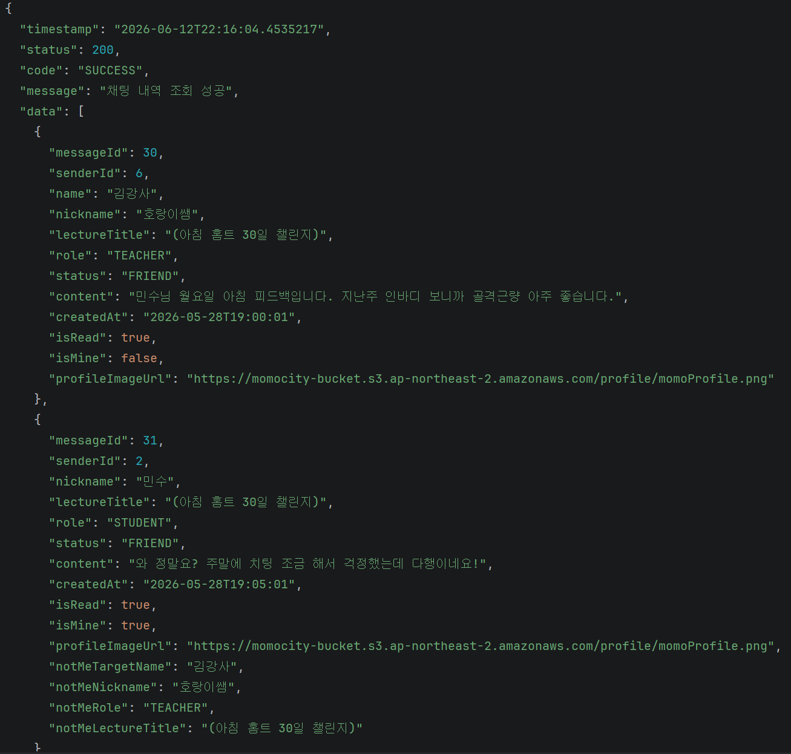

# ⚙️ 맡은 기능 (Module 3)

파편화된 팀 프로젝트 환경에서 서비스 소통의 핵심이 되는 **친구(Friend) 도메인 전반**과 실시간 **1:1 메시징 및 채팅방 라이프사이클 인프라**를 전담하여 구현했습니다. 아울러 프로젝트의 **DBA 역할**을 맡아 인프라 결함을 주도적으로 돌파했습니다.

#### 친구 및 메시징 인프라 혁신
> * **도메인 격리 및 정합성 보장**: 복잡한 소셜 비즈니스 정책(맞요청 차단, 차단 목록 프라이버시, 퇴장 유저 타임라인 격리)을 예외 케이스 기반으로 촘촘하게 설계.
> * **클라이언트 중심 API 설계**: 프론트엔드 소비처의 연산 부담을 줄이기 위해 백엔드 단에서 데이터를 최종 가공(강의명 String 합산, 탈퇴 유저 마스킹 등)하여 전달.
> * **주도적 DB 아키텍처 수립**: 팀 내 DDL/ERD 파편화 문제를 극복하기 위해 주도적인 DDL작성 및 적용으로 개발 속도를 극대화.

---

## 1. 지능형 친구 매핑 및 프라이버시 보호 시스템

### 👥 친구 목록 및 사용자 검색 관리
* **수강 신청 기반 자동 연동**: 사용자가 수강 신청을 진행하면 비동기 이벤트를 통해 `friend` 테이블에 강사-학생 관계가 자동으로 추가되는 백인프라 구축.
* **역할(Role) 기반 권한 분기 및 가공**: 
    * 로그인 유저가 학생이고 상대가 강사(`TEACHER`)일 경우, 강사의 이름/닉네임과 함께 현재 수강 중인 강의명을 매핑하여 출력.
    * 강사가 다중 강의를 담당할 시, 백엔드 단에서 자바 스트림과 `String.join(", ", ...)`을 활용해 `(파이썬, 빅데이터)` 형태의 단일 문자열로 최적화 가공 후 프론트 전달.
* **철저한 프라이버시 마스킹**: 회원 탈퇴나 비활성화(`ACTIVE` 상태가 아닌) 유저, 또는 차단(`BLOCK`) 상태의 유저가 조회될 경우 백엔드에서 닉네임을 **`(알 수 없음)`**으로 강제 치환하여 보안성 강화.
* **차단 목록 주체 식별**: 친구 차단 시 `fromUserId`를 차단 주체로 명확히 명시하여, 상대방이 나를 차단한 내역은 내 차단 목록에 노출되지 않도록 데이터 격리 성공.

* 친구 목록 조회 로직 
> > 

* 친구 목록 조회 - 응답 JSON 
> >  

* 사용자 검색 로직 
> > 

* 사용자 검색 - 응답 JSON 
> > 
> * ** "자"를 검색한 상태로 닉네임에 "자"를 포함된 사용자를 조회합니다.**

---

## 2. 엄격한 비즈니스 정책 기반 친구 요청 관리

### 📥 친구 요청 및 수락/거절/철회 라이프사이클
* **촘촘한 예외 검증 레이어**: 데이터 정합성 오염을 막기 위해 6단계 예외 처리 구조 확립.
    * *이미 친구 상태인 경우* ➡️ `"이미 친구 상태인 사용자입니다."`
    * *이미 내가 요청을 보낸 경우* ➡️ `"이미 요청을 보낸 대상입니다."`
    * *상대방이 먼저 나에게 요청한 경우 (맞요청)* ➡️ `"상대방이 이미 회원님에게 친구 요청을 보낸 상태입니다."`
    * *차단된 유저에게 요청 시* ➡️ `"차단된 사용자에게는 친구 요청을 보낼 수 없습니다."`
    * *상대방이 존재하지 않는 경우* ➡️ `"존재하지 않은 사용자에게 요청을 보낼 수 없습니다."`
    * *학생이 아닌 강사/관리자에게 요청 시* ➡️ `"강사 및 관리자에겐 친구 요청을 보낼 수 없습니다."` (오직 학생 간에만 친구 기능 허용)
* **비동기 알림(Notification) 인프라**:
    * 친구 요청 발생 시 상대방 공간에 `"{nickname}님이 친구를 요청했습니다."` 알림 생성.
    * 친구 수락 완료 시 요청 발신자 공간에 `"{nickname}님과 친구가 되었습니다. 교류를 시작해보세요!"` 알림을 비동기 이벤트 기반으로 발행.

* 친구 요청 및 수락 로직 
> > 

* 친구 요청 실패 시 - 예외 공통 응답 JSON 스냅샷 
> > 
> * ** 상대방이 이미 요청을 보낸 상테에서 맞요청 시의 예외 발생 상황입니다. **

---

## 3. 1:1 메시징 인프라 및 채팅방 라이프사이클 (하이브리드 방식)

### 💬 실시간 메시지 전송 및 읽음 처리
* **하이브리드 메시징 아키텍처**: 발신은 HTTP POST를 통해 안정적으로 DB에 적재하고, 실시간 수신 및 갱신은 WebSocket(STOMP) 구독 채널(`/sub/chat/room/{roomId}`)을 활용해 방출(Publish)하는 구조 설계.
* **연속 발신 시 데이터 매핑**: 로그인 유저가 연속으로 다량의 메시지를 보낼 때도, 프론트엔드 요청에 대응하여 상대방의 역할(Role)에 따른 프로필 정보(닉네임, 이름, 역할, 강의명)가 누락 없이 출력되도록 응답 뷰 구조화.
* **비동기 메시지 알림**: 메시지 전송 시 비동기 이벤트를 발행하여 `notification` 테이블에 알림을 추가하며, 기존 내역이 존재하면 데이터 중복 생성을 방지하고 최신 메시지 내용과 시간, 읽음 여부만 `Update`하도록 최적화.

* 1:1 실시간 대화방 로직 
> > 

* 메시지 내역 조회 응답 
> > 
> * ** 강사와의 메시지 내역입니다. 프론트 측 요청으로 내가 보낸 메시지인지 구분하는 `isMine`을 추가하고 쿼리스트링으로 넘어오는 마지막 메시지 번호를 기준으로 20개씩 조회됩니다. **

### 🚪 나와의 채팅방 및 남은 인원수 기반 퇴장 정책
* **나와의 채팅방 자동 개설**: 회원가입 완료와 동시에 비동기 이벤트를 수신하여 전용 '나와의 채팅방'을 자동 생성하며, 임의로 본인과의 대화방을 중복 개설하는 행위 차단.
* **안읽음 카운트 0건 고정**: 내가 나에게 보낸 메시지는 언제나 읽음 상태여야 하므로, 채팅방 목록 조회 시 안읽은 메시지 카운트 쿼리를 호출하지 않고 **무조건 0개로 강제 고정**하는 보정 로직 구현.
* **남은 인원수 기반 데이터 격리**: 채팅방 퇴장 시 데이터를 일률적으로 `Hard Delete`하지 않고 참여 인원수를 체크하여 남은 사용자에게 기존 대화 자산을 보장.
* **타임라인 격리 알고리즘**: 상대방이 나간 뒤 나중에 재입장하거나 메시지를 보낸 경우, 존재하는 채팅방 개설 날짜와 해당 멤버의 생성 날짜(`createdAt`)를 비교하여 **본인이 방에 참여한 시점 이후의 메시지만 타임라인에 노출**되도록 격리.
* **메시지 내역 역추적**: 채팅방 퇴장 사용자가 다시 개설하면 메시지 내역을 역추적 후 기존 채팅방으로 안내.

* 채팅방 목록 및 안읽음 표시 로직 
> > 

---

## 4. DBA 역할 수행 및 인프라 파편화 돌파

팀 프로젝트 진행 중 발생한 협업 부재와 인프라 붕괴 상황을 백엔드 엔티티 및 저장소 구조 혁신으로 정면 돌파했습니다.

* **ERD 및 DDL 파편화 추적**: 프로젝트 메니저(PL)가 ERD를 버전별로 무분별하게 새로 생성하여 공유하고, 초기에 DDL조차 통일되지 않아 개발 인프라가 마비될 위기에 처했습니다. 이에 팀 내 결함이 있던 ERD 구조를 역추적하여 문법 및 관계 오류 문제를 제기하고 수정을 주도했습니다.
* **독자적 DDL 수립을 통한 초고속 개발**: 팀원들의 소통 지연과 인프라 확정을 기다리지 않고, **초기 기획 단계를 바탕으로 혼자만의 명확한 DDL을 선제적으로 구축**하여 전체 백엔드 개발자 중 가장 빠르게 핵심 비즈니스 로직을 구현 완료했습니다.
* **SideRepository 아키텍처 설계**: 제가 배포한 테스트용 더미 데이터를 팀원들이 읽지 않거나 사용하지 않아 타 도메인 엔티티 통합 시 컴파일 에러가 다수 발생하는 병목이 있었습니다. 개발 마감 직전의 촉박한 시간 속에서, 친구/메시지 기능 전용 타도메인 껍데기 `JpaEntity`를 선언하고 이들을 연결하는 **`SideRepository` 통로를 구축**해 냄으로써, 타 파트의 결함에 영향을 받지 않는 독립적이고 현실적인 클린 아키텍처 구조를 완성하여 연동을 완수했습니다.

---

### 🔗 소스 코드 확인
* [LMS 친구 & 메시징 프로젝트 전체 소스 코드 (GitHub)](https://github.com/seojeongrim-tech/wanted_project)

---

## 💡 구현 특징 요약

1. **철저한 예외 케이스 방어**: 맞요청 검증, 차단 프라이버시 분리, 중복 요청 불가 등 비즈니스 정책의 구멍을 완벽히 메워 데이터 정합성 오류 0% 달성.
2. **독립적 도메인 설계**: `SideRepository` 아키텍처를 도입하여 타 파트의 개발 지연 및 엔티티 수정 여파로부터 내 도메인의 순수성과 비즈니스 로직을 안전하게 방어함.
3. **사용자 경험(UX) 중심 데이터 가공**: 프론트엔드가 데이터를 다루기 편하도록 복잡한 강사-강의 교집합 데이터나 회원 탈퇴 유저의 예외 상태를 백엔드 레이어에서 완벽히 가공하여 신뢰성 높은 API 제공.
