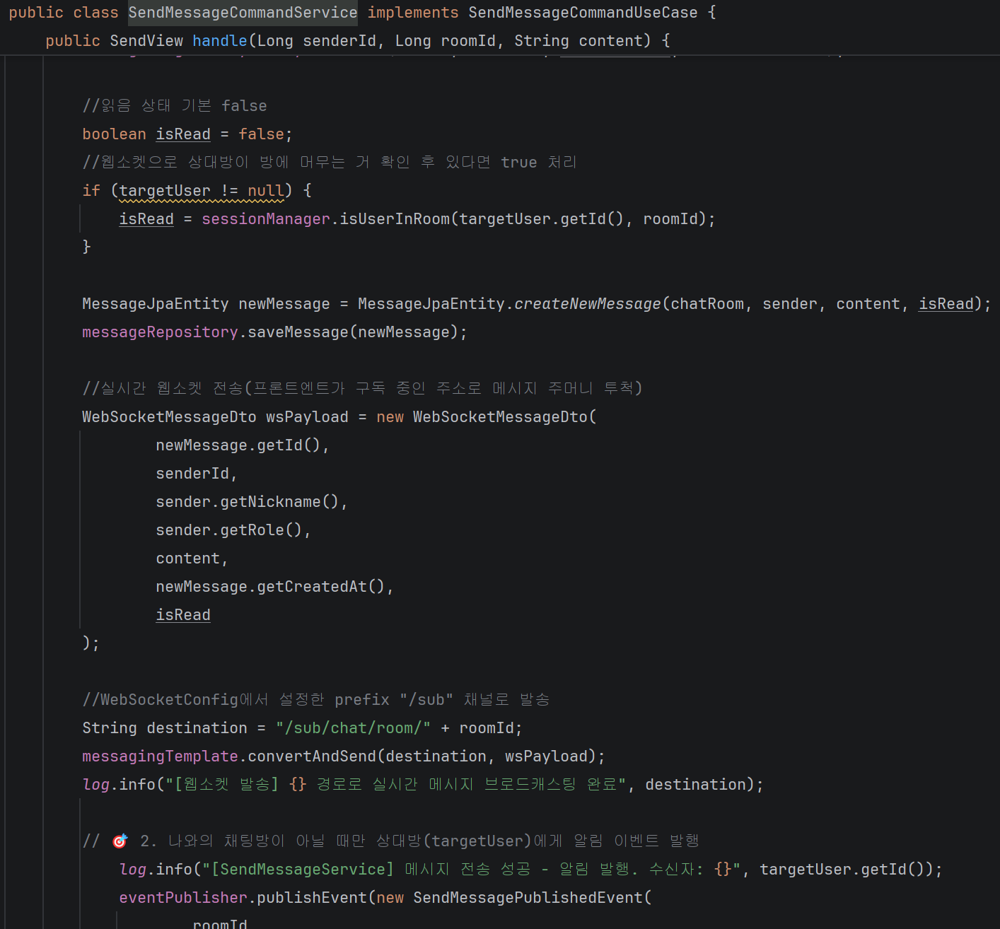

# ⚙️ 애자일 기반 커뮤니티 및 실시간 1:1 메시징 시스템 구축기 (Module 3)
> **핵심 요약:** DDD 기반 친구/메시지 정책 수립, 다중 조건 조회(AND/OR 우선순위) 트러블슈팅, 유령 방 및 맞요청 버그 차단, 재입장 사용자의 타임라인 격리 알고리즘 구현

---

## 1. 개요
모듈 3에서는 파편화된 팀 프로젝트 환경에서 서비스의 소통 중심이 되는 **친구(Friend) 도메인 전반**과 실시간 **1:1 메시징 및 채팅방 라이프사이클 인프라** 구축을 전담했습니다. 또한, 프로젝트의 DBA 역할을 수행하며 ERD 구조 결함을 추적하고, 엄격한 비즈니스 정책을 수립하여 데이터 정합성을 확보하는 데 집중했습니다.

---

## 2. 해결 과정 및 설계 의도 (Solution & Design)

   
  <small><i>▲ 모듈 3 초기 도메인 정책 및 관계 설계 아키텍처 스케치 (※ 방명록 기능은 모듈 3 설계 단계 참여 후, 모듈 4 스프린트에서 팀원 간 역할 조율로 이관되었습니다.)</i></small>

### 2-1. 지능형 친구 매핑 및 프라이버시 보호
* **자동 연동 및 권한 분기**: 수강생이 수강 신청을 진행하면 비동기 이벤트를 통해 `friend` 테이블에 강사-학생 관계가 자동으로 추가되도록 구현했습니다. 친구 목록 출력 시 로그인 유저가 학생이고 상대가 강사라면 강사의 닉네임, 이름뿐만 아니라 수강 중인 강의명을 매핑하여 출력합니다.
* **UI/UX 연산 최적화**: 강사가 여러 강의를 담당할 경우, 백엔드 단에서 자바 스트림과 `String.join(", ", ...)`을 활용해 `(파이썬, 빅데이터)` 형태의 단일 문자열로 가공 후 프론트엔드에 전달하여 클라이언트의 연산 부담을 줄였습니다.
* **철저한 프라이버시 마스킹**: 회원 탈퇴나 비활성화(`ACTIVE` 상태가 아닌) 유저, 혹은 차단(`BLOCK`) 상태의 유저가 조회될 경우 닉네임을 백엔드에서 **`(알 수 없음)`**으로 강제 마스킹하여 보안성을 높였습니다.

### 2-2. 나와의 채팅방 식별 및 안읽음 고정 알고리즘
* **가입 시 비동기 자동 생성**: 유저가 회원가입 시 자동으로 '나와의 채팅방'이 개설되도록 이벤트를 연동했습니다. 임의로 본인과의 대화방을 중복 생성하는 행위를 차단했습니다.
* **비즈니스 특화 정합성**: 나와의 채팅방은 메시지를 전송하더라도 언제나 읽음 상태여야 하므로, 채팅방 목록 조회 시 **안읽은 메시지 개수를 항상 0개로 고정**하는 보정 로직을 반영했습니다.
* **네트워크 데이터 최적화**: 응답 데이터 용량을 최적화하기 위해, 발신자 ID(`senderId`)와 현재 로그인 유저 ID의 일치 여부를 대조하여 본인이 발송한 메시지는 안읽은 메시지 개수 연산 및 UI 노출 대상에서 원천 제외시켰습니다.

### 2-3. 남은 인원수 기반 채팅방 퇴장 정책
* **데이터 격리(Hard Delete 지양)**: 사용자가 채팅방을 나갈 때 무조건 데이터를 삭제하지 않고, 방에 남은 인원수를 체크하여 남은 사용자에게는 기존 메시지 내역을 보장합니다. 
* **타임라인 격리**: 상대방이 나간 뒤 나중에 재입장하거나 메시지를 보낸 경우, 존재하는 채팅방 개설 날짜와 해당 멤버의 생성 날짜(`createdAt`)를 비교하여 **본인이 방에 참여한 시점 이후의 메시지만 타임라인에 출력**되도록 격리했습니다.

---

## 3. 구조 및 데이터 흐름 (Architecture & Data Flow)

### 3-1. 실시간 메시지 전송 및 알림 흐름 (하이브리드 방식)
발신은 HTTP POST를 사용하고, 수신 및 실시간 갱신은 WebSocket(STOMP) 구독 채널을 활용한 아키텍처입니다.

1. **Request**: 클라이언트가 HTTP POST `/api/v1/messages/send/{roomId}`로 메시지 요청을 보냅니다. 차단 상태이거나 상대방이 방을 나간 상태인 경우 전송을 원천 차단하고 예외 처리를 수행합니다.
2. **Validation & Identification**: `@AuthenticationPrincipal`을 통해 권한을 검증하고, 현재 로그인 유저가 해당 채팅방에 접근 권한이 있는지 체크합니다. 친구 관계가 아니거나 상대방이 방을 나간 상태라면 전송을 차단합니다.
3. **Processing**: DB에 메시지를 안전하게 저장한 뒤, 비동기 이벤트를 발행하여 `notification` 테이블에 `"{nickname}님이 메시지를 전송했습니다."` 행을 추가 또는 업데이트(알림 내용, 시간, 읽음 여부 갱신)합니다. (친구 요청 수락/거절, 방명록 작성 등도 동일하게 이벤트를 통해 비동기 처리되도록 설계했습니다.)
4. **WebSocket Publish**: `SimpMessagingTemplate`을 활용해 `/sub/chat/room/{roomId}` 채널로 메시지 객체를 방출(Publish)합니다.
5. **Response**: 해당 방을 구독(Subscribe) 중인 상대방 화면에 실시간으로 메시지가 렌더링되도록 합니다. 알림 조회 시 다차원적인 비즈니스 요건에 맞춰 우체통 알림(isRead), 읽지 않은 메시지 및 친구 요청 건수(unreadCount)를 분리하여 정확히 노출합니다.
(프론트엔드 쪽 웹소켓 코드 미구현 상태)

---

## 4. 트러블슈팅 (Troubleshooting)

> **❌ 타도메인 참조로 인한 개발 지연 우려 이슈**
> * **현상**: 프론트와 협의하여 API에 설계한 응답 데이터를 준수하기 위해 타도메인을 필요로 하여 개발 지연이 우려되는 문제 발생.
> * **원인**: 친구, 메시지 관련 목록 조회 시 (알 수 없음) 처리와 강의명 매핑을 위해 `UserJpaEntity`, `ErollmentJpaEntity`, `LectureJpaEntity` 클래스가 필요했음.
> * **해결**: 개발 지연 방지를 위해 임의적으로 사용할 3개의 `JpaEntity` 클래스를 생성하여 백엔드 팀원 중 가장 먼저 기능 구현을 끝냈습니다.

> **❌ `JpaEntity` 외래키 타입 미통일 이슈**
> * **현상**: `JpaEntity`의 외래키 타입이 임의 생성한 것과 담당 팀원의 것이 일치하지 않아 import 시 구현한 모든 로직을 수정해야 했음.
> * **원인**: 백엔드 팀원끼리 사전 협의가 이뤄지지 않아 임의로 생성한 타도메인 `JpaEntity` 클래스를 pull받아 팀원이 생성한 `JpaEntity`를 참조하려 했으나 외래키 타입이 불일치하여 import 시 컴파일 에러 다수 발생했음.
> * **해결**: 개발 완료 시점까지 시간이 촉박하여 불가피하게 친구, 메시지 기능 전용 타도메인 `JpaEntity` 클래스를 생성하였고 `SideRepository` 형태로 친구, 메시지와 사용자, 수강, 강의를 연결하는 통로를 만들어 현실적인 클린 아키텍처 구조를 잡았습니다.

> **❌ JPA 자동 쿼리 생성 시 AND/OR 우선순위로 인한 조건 오류**
> * **현상**: 친구 목록 조회 시, `FRIEND` 상태가 아닌 유저(요청 중, 차단 등)까지 화면에 노출되는 현상 발생.
> * **원인**: JPA Method Name Query 사용 시 `AND` 연산이 `OR` 연산보다 우선순위가 높아 조건 절의 괄호가 의도치 않게 묶임.
> * **해결**: 서비스 레이어에서 명확하게 `status == FRIEND`인 경우만 필터링하는 방어 로직을 추가하여 데이터 정합성을 보장했습니다.

> **❌ 나와의 채팅방 중복 인식 및 유령 방 생성 버그**
> * **현상**: 상대방이 메시지를 남기지 않고 방을 나갔을 때, 시스템이 이를 '나와의 채팅방'으로 오인하여 목록에 나와의 채팅방이 2개로 인식되는 이슈 발생.
> * **원인**: 방의 참여 인원과 메시지 이력을 검증하는 로직에서 나간 사람의 상태 값을 명확히 격리하지 못함.
> * **해결**: 대화방 조회 및 개설 시 `findAnyRelationBetween` 검증을 도입하여 쌍방향 관계를 명확히 추적하고, 상대방이 메시지 없이 나간 경우에만 방을 새로 개설하도록 예외 처리를 고도화했습니다.

> **❌ 차단 목록 프라이버시 이슈**
> * **현상**: 상대방이 나를 차단한 내역도 차단 목록에 조회되는 이슈 발생.
> * **원인**: 두 명의 사용자가 하나의 행으로 친구 관계가 관리되지만 친구 차단 시 차단 주체를 구분하지 않고 status값만 변경함.
> * **해결**: 친구 차단 시에 `fromUserId`가 차단 주체가 되도록 변경하여 차단 목록 조회 시 내가 `fromUserId`이면서 `status == BLOCK`인 경우만 필터링하는 방어 로직을 추가하여 프라이버시 보호에 성공했습니다.

> **❌ 연관 엔티티 ID 비교 시 객체 참조 비교 오류**
> * **현상**: 강사-학생 매핑 로직에서 ID가 일치함에도 조건문이 `false`를 반환하는 문제 발생.
> * **원인**: 엔티티 내부에서 타입이 객체(`LectureJpaEntity`)로 선언되어 있어, `lecture.getTeacherId()`로 비교 시 ID 값이 아닌 객체 주소값을 비교함.
> * **해결**: `.getTeacherId().getId().equals(user.getId())`와 같이 최종 식별자 ID를 직접 꺼내어 비교하도록 수정하여 해결했습니다.

> **❌ Preflight (OPTIONS) 요청에 의한 CORS/권한 차단 이슈**
> * **현상**: 프론트엔드와 WebSocket 및 API 연동 중 브라우저에서 권한 에러 발생.
> * **원인**: 브라우저가 본 요청을 보내기 전 안전성 확인을 위해 보내는 Preflight(`OPTIONS`) 요청이 Spring Security 필터 체인에 걸려 거부됨.
> * **해결**: Security Config의 필터 체인 설정에서 `HttpMethod.OPTIONS` 요청을 무조건 허용(`permitAll()`)하도록 아키텍처를 개선했습니다.

> **❌ API 응답 객체(Response DTO) 데이터 스왑(Swap) 바인딩 오류**
> * **현상**: 사용자 닉네임 검색 API 테스트 중, 의도된 검색 조건과 다르게 응답 JSON 데이터의 이름(`name`)과 닉네임(`nickname`) 필드가 서로 뒤바뀌어 반환되는 현상 발견.
> * **원인**: DB 데이터는 정상이었으나, 응답 객체(Response DTO) 생성자 바인딩 레이어에서 두 파라미터의 바인딩 순서가 오인 입력되어 엇갈림.
> * **해결**: Response 클래스의 바인딩 매핑 순서를 올바르게 수정하여 프론트엔드 데이터 노출 및 검색 정합성 100%를 확보했습니다.

---

## 5. 결과 및 성과 (Results)
* **데이터 정합성**: 중복 친구 요청 방지, 맞요청 차단, 차단 유저 요청 불허 등 철저한 예외 케이스 방어로 엣지 케이스 오류 0% 달성.
* **복잡한 정책 수립**: 강사 및 관리자 관련 직접 친구 관계 변경과 메시지 관련 기능 불가, 기존 사용자 기반 메시지 보존 및 남은 인원수 분기 처리 채팅방 나가기 등의 복잡한 정책을 스스로 판단하여 수립함.
* **DB 관리자 역할 수행**: 팀 내 결함이 있던 ERD 구조를 역추적하여 DDL 오류 문제를 제기 및 수정하고, 통합 저장소 병합을 주도하여 인프라 운영 능력을 증명함.
* **실시간 명세 동기화를 통한 애자일 소통 리드**: 프론트엔드 개발자가 병목 없이 즉각 작업에 착수할 수 있도록, API 개발 및 변경 사항이 발생할 때마다 노션 명세서에 진행 상황(진행 중, 완료 등)을 실시간으로 직접 공유 및 동기화하여 연동 생산성을 극대화했습니다.

---

## 6. 리팩토링 및 모듈 4 확장 계획 (Refactoring & Next Steps)

### 📋 [모듈 4 예고] 연속 발신 시 방 정보(상대방 프로필) 유실 결함 수정 및 페이징 보완
* **AS-IS (현재의 한계)**: 현재 최신 20개의 메시지 내역을 끊어오는 스크롤 기반 페이징을 적용해 두었습니다. 그러나 만약 특정 대화방에서 **최근 20개의 메시지 전부를 로그인한 유저(나)가 연속으로 보낸 경우**, 반환되는 데이터 스냅샷 내에 상대방의 메시지 엔티티가 존재하지 않아 화면에 상대방의 정보(방 정보)를 매핑할 수 없는 치명적인 엣지 케이스 결함이 존재함을 발견했습니다. 현재 프론트엔드 쪽 웹소켓 코드가 미구현된 상태라 연동 중에 완벽히 잡아내지 못했습니다.
* **TO-BE (모듈 4 개선 계획)**: 단순히 메시지 이력 테이블만 역순으로 20개 조회하는 방식에서 벗어나, 메시지 내역이 없거나 전부 본인이 작성한 메시지이더라도 대화방 테이블(`ChatRoom`) 및 참여자 매핑 테이블을 크로스 체크하여 **상대방의 프로필 정보와 방 메타데이터가 무조건 보장되도록 쿼리 및 DTO 반환 구조를 리팩토링할 예정(모듈 4 반영)**입니다.

* **AS-IS (현재의 문제점)**: Aggregate를 기준으로 `service` 클래스가 query와 command 구조로 구성되어야 하지만 현재는 기능마다 `service`가 존재합니다.
* **TO-BE (모듈 4 개선 계획)**: 강사님의 피드백을 바탕으로 Aggregate를 기준으로 `service` 클래스를 query와 command 구조로 구성하여 유지보수성을 확장할 예정입니다.

* **AS-IS (현재의 문제점)**: 친구, 메시지 관련 정책 클래스(`EligibilityPolicy`)가 존재함에도 클린 아키텍처, 바운디드 컨텍스트 등 아키텍처 구조에 대한 이해 부족으로 일부 기능은 정책 클래스에 완전 위임하지 못하는 문제를 확인했습니다.
* **TO-BE (모듈 4 개선 계획)**: 친구, 메시지 관련 정책(ex. 본인이 보내지 않은 친구 요청 철회 불가, 채팅방에 접근 권한 없음 등)에 해당하는 사항은 `service` 클래스가 아닌 `EligibilityPolicy` 클래스에 위임하도록 리팩토링할 예정입니다. 
* **모듈 4 연속성 확보를 위한 선제적 비동기 이벤트 설계**: 모듈 4 스프린트의 빠른 개발과 다대다 채팅 확장 성능을 고려하여, 친구 수락, 메시지 전송, 방명록 작성 등 핵심 행위가 발생할 시 알림(`notification`) 테이블로 데이터가 비동기 분리 적재되도록 아키텍처 기반을 선제 수립해 두었습니다.

---

## 7. 팀 협업 및 소통의 한계 극복 (Team Collaboration & Hardships)
이번 프로젝트는 파편화된 팀 환경과 소통의 부재 속에서 백엔드 개발자로서 중심을 지키기 위해 치열하게 버텨낸 과정이었습니다.

* **비효율적 기획으로 인한 일정 지연**: 프로젝트 초기, 기획의 범위를 지나치게 깊고 방대하게 설정하면서 정작 개발에 투입할 수 있는 물리적 시간이 대폭 축소되었습니다. 이로 인해 주말까지 계속 반납하며 개발을 진행해야 하는 체력적, 심리적 한계에 부딪혔습니다.
* **비대면 소통의 부재와 위축**: 업무 효율을 위해 슬랙으로 끊임없이 질문을 던지고 이슈를 발행했으나, 팀원들의 읽지 않음과 무답장이 지속되었습니다. 결국 모든 사항을 구두로 다시 찾아가 확인해야 하는 비효율이 반복되었고, 이 과정에서 소통에 대한 피로감이 쌓여 회의에 적극적으로 참여하기 어려워지는 심리적 위축을 겪기도 했습니다.
* **불리한 연동 환경에서의 역량 증명**: 제가 담당한 친구 및 실시간 메시징 도메인이 가장 복잡하고 핵심적인 로직이었음에도, 팀 내에서 부가 기능으로 치부되어 프론트엔드 연동 순위가 최하위로 밀렸습니다. 게다가 `.env` 파일 등 필수 환경변수가 공유되지 않아 제 기능이 화면에서 어떻게 돌아가는지 단 한 번도 직접 테스트해보지 못하는 악조건 속에서 연동을 시작했습니다.
* **이유 있는 코드의 힘**: 촉박한 시간 탓에 프론트엔드 화면이 초기 피그마 설계와 다르게 흘러가 어디에 어떤 데이터가 매핑되는지조차 알기 어려웠습니다. 하지만 **초기 설계 단계부터 예외 케이스와 비즈니스 정책을 스스로 의심하고 검증해가며 견고하게 구축해 둔 덕분**에, 가장 마지막에 연동을 시작했음에도 불구하고 다른 팀원들보다 훨씬 빠르고 안정적으로 프론트엔드 파트와 연동을 완료하며 작성한 코드의 품질을 증명해냈습니다.

### 🔗 소스 코드 확인
* [LMS 친구 & 메시징 프로젝트 전체 소스 코드 (GitHub)](https://github.com/seojeongrim-tech/wanted_project)
